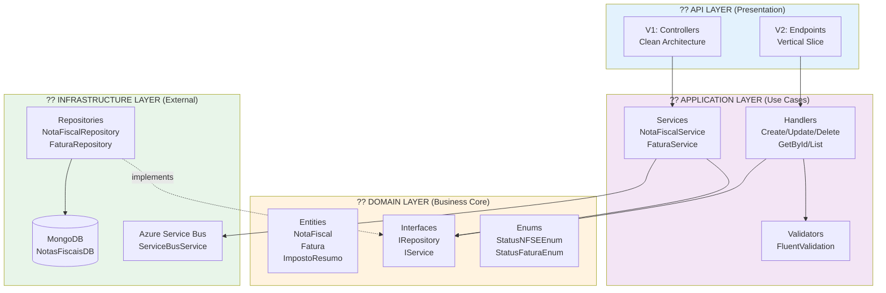
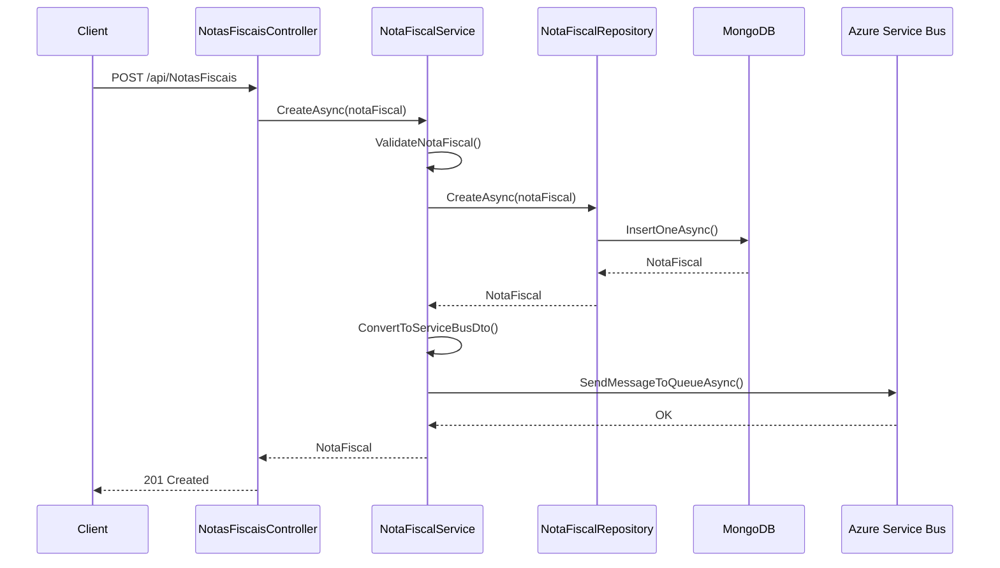
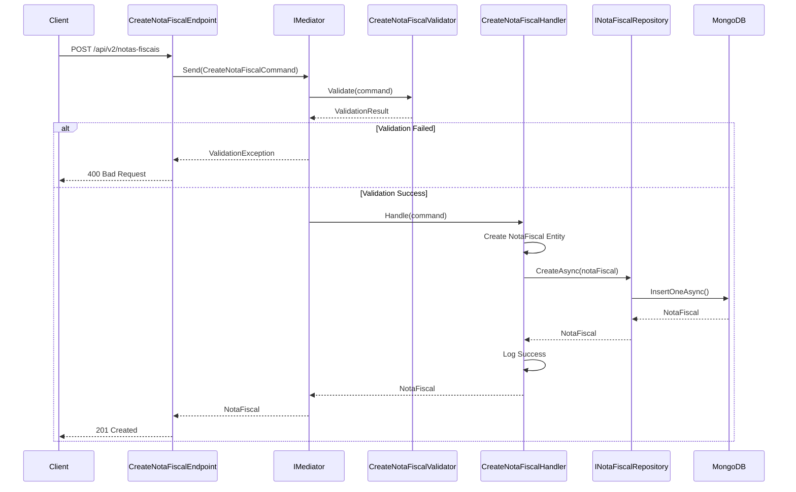
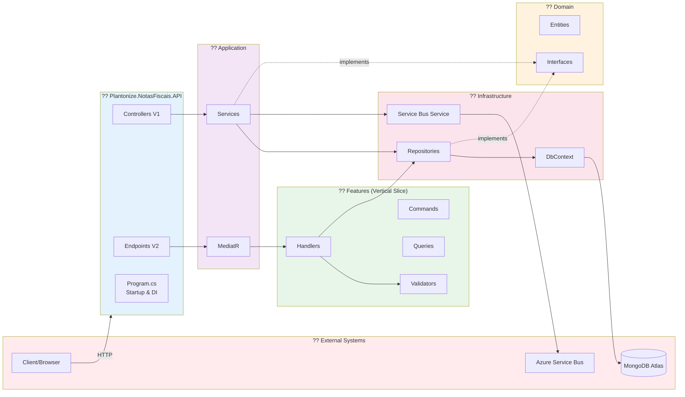

# ?? Diagrama de Classes - Plantonize NotasFiscais API

## Diagrama Completo do Sistema

```mermaid
classDiagram
    %% ========================================
    %% DOMAIN LAYER (Core)
    %% ========================================
    
    class NotaFiscal {
        +Guid Id
        +string? NumeroNota
        +DateTime DataEmissao
        +decimal ValorTotal
        +StatusNFSEEnum Status
        +string? MunicipioPrestacao
        +bool IssRetido
        +MedicoFiscal? Medico
        +TomadorServico? Tomador
        +List~ItemServico~? Servicos
        +bool EnviadoEmail
        +DateTime? DataEnvioEmail
    }
    
    class MedicoFiscal {
        +string? Nome
        +string? CpfCnpj
        +string? Email
        +string? Telefone
        +string? Endereco
        +string? Municipio
        +string? Especialidade
    }
    
    class TomadorServico {
        +string? Nome
        +string? CpfCnpj
        +string? Email
        +string? Telefone
        +string? Endereco
        +string? Municipio
    }
    
    class ItemServico {
        +string? Descricao
        +int Quantidade
        +decimal ValorUnitario
        +decimal? AliquotaIss
        +decimal? ValorTotal
    }
    
    class Fatura {
        +Guid Id
        +string? NumeroFatura
        +DateTime DataEmissao
        +DateTime DataVencimento
        +decimal ValorTotal
        +StatusFaturaEnum Status
        +Guid MedicoId
        +List~NotaFiscal~? NotasFiscais
    }
    
    class ImpostoResumo {
        +Guid Id
        +Guid MedicoId
        +int Ano
        +int Mes
        +decimal TotalServicos
        +decimal TotalISS
        +decimal TotalINSS
        +decimal TotalIR
        +decimal TotalCSLL
        +decimal TotalPIS
        +decimal TotalCOFINS
    }
    
    class MunicipioAliquota {
        +Guid Id
        +string? Municipio
        +string? UF
        +string? CodigoIBGE
        +decimal AliquotaISS
        +decimal? AliquotaINSS
        +decimal? AliquotaIR
    }
    
    class StatusNFSEEnum {
        <<enumeration>>
        Autorizado
        Rejeitado
        Cancelado
        Emitida
        Enviada
        Paga
    }
    
    class StatusFaturaEnum {
        <<enumeration>>
        Pendente
        Paga
        Cancelada
        Vencida
    }
    
    %% ========================================
    %% DOMAIN INTERFACES
    %% ========================================
    
    class INotaFiscalRepository {
        <<interface>>
        +GetByIdAsync(Guid id) Task~NotaFiscal~
        +GetAllAsync() Task~IEnumerable~NotaFiscal~~
        +GetByMedicoIdAsync(Guid medicoId) Task~IEnumerable~NotaFiscal~~
        +CreateAsync(NotaFiscal notaFiscal) Task~NotaFiscal~
        +UpdateAsync(NotaFiscal notaFiscal) Task~NotaFiscal~
        +DeleteAsync(Guid id) Task
    }
    
    class INotaFiscalService {
        <<interface>>
        +GetByIdAsync(Guid id) Task~NotaFiscal~
        +GetAllAsync() Task~IEnumerable~NotaFiscal~~
        +GetByMedicoIdAsync(Guid medicoId) Task~IEnumerable~NotaFiscal~~
        +CreateAsync(NotaFiscal notaFiscal) Task~NotaFiscal~
        +UpdateAsync(NotaFiscal notaFiscal) Task~NotaFiscal~
        +DeleteAsync(Guid id) Task
        +ExistsAsync(Guid id) Task~bool~
    }
    
    class IFaturaRepository {
        <<interface>>
        +GetByIdAsync(Guid id) Task~Fatura~
        +GetAllAsync() Task~IEnumerable~Fatura~~
        +CreateAsync(Fatura fatura) Task~Fatura~
        +UpdateAsync(Fatura fatura) Task~Fatura~
        +DeleteAsync(Guid id) Task
    }
    
    class IServiceBusService {
        <<interface>>
        +SendMessageToQueueAsync(object message, string queueName) Task
        +ReceiveMessageFromQueueAsync(string queueName) Task~string~
    }
    
    %% ========================================
    %% APPLICATION LAYER (Clean Architecture)
    %% ========================================
    
    class NotaFiscalService {
        -INotaFiscalRepository _repository
        -IServiceBusService _serviceBusService
        +GetByIdAsync(Guid id) Task~NotaFiscal~
        +GetAllAsync() Task~IEnumerable~NotaFiscal~~
        +GetByMedicoIdAsync(Guid medicoId) Task~IEnumerable~NotaFiscal~~
        +CreateAsync(NotaFiscal notaFiscal) Task~NotaFiscal~
        +UpdateAsync(NotaFiscal notaFiscal) Task~NotaFiscal~
        +DeleteAsync(Guid id) Task
        +ExistsAsync(Guid id) Task~bool~
        -ValidateNotaFiscal(NotaFiscal notaFiscal) void
        -ConvertToServiceBusDto(NotaFiscal notaFiscal) NotaFiscalServiceBusDto
    }
    
    class FaturaService {
        -IFaturaRepository _repository
        +GetByIdAsync(Guid id) Task~Fatura~
        +GetAllAsync() Task~IEnumerable~Fatura~~
        +CreateAsync(Fatura fatura) Task~Fatura~
        +UpdateAsync(Fatura fatura) Task~Fatura~
        +DeleteAsync(Guid id) Task
    }
    
    class NotaFiscalServiceBusDto {
        +string _id
        +string numeroNota
        +string codigo_servico
        +string descricao
        +decimal valor
        +string cpf_cnpj_cliente
        +string cliente
        +string email
        +string cep
        +string endereco
        +string numero
        +string bairro
        +string codigo_municipio
        +string municipio
        +string uf
    }
    
    %% ========================================
    %% VERTICAL SLICE - COMMANDS & QUERIES
    %% ========================================
    
    class CreateNotaFiscalCommand {
        <<record>>
        +string? NumeroNota
        +DateTime DataEmissao
        +decimal ValorTotal
        +string? MunicipioPrestacao
        +bool IssRetido
        +MedicoFiscal? Medico
        +TomadorServico? Tomador
        +List~ItemServico~? Servicos
    }
    
    class UpdateNotaFiscalCommand {
        <<record>>
        +Guid Id
        +string? NumeroNota
        +DateTime? DataEmissao
        +decimal? ValorTotal
        +string? MunicipioPrestacao
        +bool? IssRetido
        +StatusNFSEEnum? Status
        +MedicoFiscal? Medico
        +TomadorServico? Tomador
        +List~ItemServico~? Servicos
    }
    
    class DeleteNotaFiscalCommand {
        <<record>>
        +Guid Id
    }
    
    class GetNotaFiscalQuery {
        <<record>>
        +Guid Id
    }
    
    class ListNotasFiscaisQuery {
        <<record>>
    }
    
    %% ========================================
    %% VERTICAL SLICE - HANDLERS
    %% ========================================
    
    class CreateNotaFiscalHandler {
        -INotaFiscalRepository _repository
        -ILogger~CreateNotaFiscalHandler~ _logger
        +Handle(CreateNotaFiscalCommand request, CancellationToken ct) Task~NotaFiscal~
    }
    
    class UpdateNotaFiscalHandler {
        -INotaFiscalRepository _repository
        -ILogger~UpdateNotaFiscalHandler~ _logger
        +Handle(UpdateNotaFiscalCommand request, CancellationToken ct) Task~NotaFiscal~
    }
    
    class DeleteNotaFiscalHandler {
        -INotaFiscalRepository _repository
        -ILogger~DeleteNotaFiscalHandler~ _logger
        +Handle(DeleteNotaFiscalCommand request, CancellationToken ct) Task~bool~
    }
    
    class GetNotaFiscalHandler {
        -INotaFiscalRepository _repository
        -ILogger~GetNotaFiscalHandler~ _logger
        +Handle(GetNotaFiscalQuery request, CancellationToken ct) Task~NotaFiscal~
    }
    
    class ListNotasFiscaisHandler {
        -INotaFiscalRepository _repository
        -ILogger~ListNotasFiscaisHandler~ _logger
        +Handle(ListNotasFiscaisQuery request, CancellationToken ct) Task~IEnumerable~NotaFiscal~~
    }
    
    %% ========================================
    %% VERTICAL SLICE - VALIDATORS
    %% ========================================
    
    class CreateNotaFiscalValidator {
        +CreateNotaFiscalValidator()
        +Validate(CreateNotaFiscalCommand command) ValidationResult
    }
    
    class UpdateNotaFiscalValidator {
        +UpdateNotaFiscalValidator()
        +Validate(UpdateNotaFiscalCommand command) ValidationResult
    }
    
    %% ========================================
    %% INFRASTRUCTURE LAYER
    %% ========================================
    
    class NotaFiscalRepository {
        -IMongoCollection~NotaFiscal~ _collection
        +GetByIdAsync(Guid id) Task~NotaFiscal~
        +GetAllAsync() Task~IEnumerable~NotaFiscal~~
        +GetByMedicoIdAsync(Guid medicoId) Task~IEnumerable~NotaFiscal~~
        +CreateAsync(NotaFiscal notaFiscal) Task~NotaFiscal~
        +UpdateAsync(NotaFiscal notaFiscal) Task~NotaFiscal~
        +DeleteAsync(Guid id) Task
    }
    
    class FaturaRepository {
        -IMongoCollection~Fatura~ _collection
        +GetByIdAsync(Guid id) Task~Fatura~
        +GetAllAsync() Task~IEnumerable~Fatura~~
        +CreateAsync(Fatura fatura) Task~Fatura~
        +UpdateAsync(Fatura fatura) Task~Fatura~
        +DeleteAsync(Guid id) Task
    }
    
    class ServiceBusService {
        -ServiceBusClient _client
        -string _connectionString
        +SendMessageToQueueAsync(object message, string queueName) Task
        +ReceiveMessageFromQueueAsync(string queueName) Task~string~
    }
    
    class NotasFiscaisDBContext {
        -IMongoDatabase _database
        +NotasFiscais IMongoCollection~NotaFiscal~
        +Faturas IMongoCollection~Fatura~
        +ImpostosResumo IMongoCollection~ImpostoResumo~
        +MunicipiosAliquota IMongoCollection~MunicipioAliquota~
    }
    
    %% ========================================
    %% API LAYER - CONTROLLERS (Clean Architecture)
    %% ========================================
    
    class NotasFiscaisController {
        -INotaFiscalService _service
        +GetAll() Task~IActionResult~
        +GetById(Guid id) Task~IActionResult~
        +Create(NotaFiscal notaFiscal) Task~IActionResult~
        +Update(Guid id, NotaFiscal notaFiscal) Task~IActionResult~
        +Delete(Guid id) Task~IActionResult~
    }
    
    class FaturasController {
        -IFaturaService _service
        +GetAll() Task~IActionResult~
        +GetById(Guid id) Task~IActionResult~
        +Create(Fatura fatura) Task~IActionResult~
        +Update(Guid id, Fatura fatura) Task~IActionResult~
        +Delete(Guid id) Task~IActionResult~
    }
    
    %% ========================================
    %% API LAYER - ENDPOINTS (Vertical Slice)
    %% ========================================
    
    class CreateNotaFiscalEndpoint {
        -IMediator _mediator
        -ILogger~CreateNotaFiscalEndpoint~ _logger
        +Create(CreateNotaFiscalCommand command) Task~IActionResult~
    }
    
    class GetNotaFiscalEndpoint {
        -IMediator _mediator
        -ILogger~GetNotaFiscalEndpoint~ _logger
        +GetById(Guid id) Task~IActionResult~
    }
    
    class ListNotasFiscaisEndpoint {
        -IMediator _mediator
        -ILogger~ListNotasFiscaisEndpoint~ _logger
        +List() Task~IActionResult~
    }
    
    class UpdateNotaFiscalEndpoint {
        -IMediator _mediator
        -ILogger~UpdateNotaFiscalEndpoint~ _logger
        +Update(Guid id, UpdateNotaFiscalCommand command) Task~IActionResult~
    }
    
    class DeleteNotaFiscalEndpoint {
        -IMediator _mediator
        -ILogger~DeleteNotaFiscalEndpoint~ _logger
        +Delete(Guid id) Task~IActionResult~
    }
    
    %% ========================================
    %% MEDIATOR PATTERN
    %% ========================================
    
    class IMediator {
        <<interface>>
        +Send~TResponse~(IRequest~TResponse~ request, CancellationToken ct) Task~TResponse~
    }
    
    class IRequest~TResponse~ {
        <<interface>>
    }
    
    class IRequestHandler~TRequest,TResponse~ {
        <<interface>>
        +Handle(TRequest request, CancellationToken ct) Task~TResponse~
    }
    
    %% ========================================
    %% RELATIONSHIPS - DOMAIN
    %% ========================================
    
    NotaFiscal "1" --> "0..1" MedicoFiscal : has
    NotaFiscal "1" --> "0..1" TomadorServico : has
    NotaFiscal "1" --> "0..*" ItemServico : contains
    NotaFiscal --> StatusNFSEEnum : uses
    Fatura --> StatusFaturaEnum : uses
    Fatura "1" --> "0..*" NotaFiscal : contains
    
    %% ========================================
    %% RELATIONSHIPS - APPLICATION (Clean Architecture)
    %% ========================================
    
    NotaFiscalService ..|> INotaFiscalService : implements
    NotaFiscalService --> INotaFiscalRepository : uses
    NotaFiscalService --> IServiceBusService : uses
    NotaFiscalService ..> NotaFiscalServiceBusDto : creates
    
    FaturaService --> IFaturaRepository : uses
    
    NotasFiscaisController --> INotaFiscalService : uses
    FaturasController --> IFaturaService : uses
    
    %% ========================================
    %% RELATIONSHIPS - INFRASTRUCTURE
    %% ========================================
    
    NotaFiscalRepository ..|> INotaFiscalRepository : implements
    NotaFiscalRepository --> NotasFiscaisDBContext : uses
    
    FaturaRepository ..|> IFaturaRepository : implements
    FaturaRepository --> NotasFiscaisDBContext : uses
    
    ServiceBusService ..|> IServiceBusService : implements
    
    %% ========================================
    %% RELATIONSHIPS - VERTICAL SLICE
    %% ========================================
    
    CreateNotaFiscalCommand ..|> IRequest~NotaFiscal~ : implements
    UpdateNotaFiscalCommand ..|> IRequest~NotaFiscal~ : implements
    DeleteNotaFiscalCommand ..|> IRequest~bool~ : implements
    GetNotaFiscalQuery ..|> IRequest~NotaFiscal~ : implements
    ListNotasFiscaisQuery ..|> IRequest~IEnumerable~ : implements
    
    CreateNotaFiscalHandler ..|> IRequestHandler~CreateNotaFiscalCommand,NotaFiscal~ : implements
    UpdateNotaFiscalHandler ..|> IRequestHandler~UpdateNotaFiscalCommand,NotaFiscal~ : implements
    DeleteNotaFiscalHandler ..|> IRequestHandler~DeleteNotaFiscalCommand,bool~ : implements
    GetNotaFiscalHandler ..|> IRequestHandler~GetNotaFiscalQuery,NotaFiscal~ : implements
    ListNotasFiscaisHandler ..|> IRequestHandler~ListNotasFiscaisQuery,IEnumerable~ : implements
    
    CreateNotaFiscalHandler --> INotaFiscalRepository : uses
    UpdateNotaFiscalHandler --> INotaFiscalRepository : uses
    DeleteNotaFiscalHandler --> INotaFiscalRepository : uses
    GetNotaFiscalHandler --> INotaFiscalRepository : uses
    ListNotasFiscaisHandler --> INotaFiscalRepository : uses
    
    CreateNotaFiscalValidator --> CreateNotaFiscalCommand : validates
    UpdateNotaFiscalValidator --> UpdateNotaFiscalCommand : validates
    
    CreateNotaFiscalEndpoint --> IMediator : uses
    GetNotaFiscalEndpoint --> IMediator : uses
    ListNotasFiscaisEndpoint --> IMediator : uses
    UpdateNotaFiscalEndpoint --> IMediator : uses
    DeleteNotaFiscalEndpoint --> IMediator : uses
    
    IMediator --> CreateNotaFiscalHandler : dispatches
    IMediator --> UpdateNotaFiscalHandler : dispatches
    IMediator --> DeleteNotaFiscalHandler : dispatches
    IMediator --> GetNotaFiscalHandler : dispatches
    IMediator --> ListNotasFiscaisHandler : dispatches

    %% ========================================
    %% STYLING
    %% ========================================
    
    style NotaFiscal fill:#e1f5ff
    style MedicoFiscal fill:#e1f5ff
    style TomadorServico fill:#e1f5ff
    style ItemServico fill:#e1f5ff
    style Fatura fill:#e1f5ff
    style ImpostoResumo fill:#e1f5ff
    style MunicipioAliquota fill:#e1f5ff
    
    style INotaFiscalRepository fill:#fff4e6
    style INotaFiscalService fill:#fff4e6
    style IFaturaRepository fill:#fff4e6
    style IServiceBusService fill:#fff4e6
    
    style NotaFiscalService fill:#f3e5f5
    style FaturaService fill:#f3e5f5
    
    style CreateNotaFiscalCommand fill:#e8f5e9
    style UpdateNotaFiscalCommand fill:#e8f5e9
    style DeleteNotaFiscalCommand fill:#e8f5e9
    style GetNotaFiscalQuery fill:#e8f5e9
    style ListNotasFiscaisQuery fill:#e8f5e9
    
    style CreateNotaFiscalHandler fill:#e0f2f1
    style UpdateNotaFiscalHandler fill:#e0f2f1
    style DeleteNotaFiscalHandler fill:#e0f2f1
    style GetNotaFiscalHandler fill:#e0f2f1
    style ListNotasFiscaisHandler fill:#e0f2f1
    
    style NotaFiscalRepository fill:#fce4ec
    style FaturaRepository fill:#fce4ec
    style ServiceBusService fill:#fce4ec
    style NotasFiscaisDBContext fill:#fce4ec
    
    style NotasFiscaisController fill:#fff9c4
    style FaturasController fill:#fff9c4
    
    style CreateNotaFiscalEndpoint fill:#f1f8e9
    style GetNotaFiscalEndpoint fill:#f1f8e9
    style ListNotasFiscaisEndpoint fill:#f1f8e9
    style UpdateNotaFiscalEndpoint fill:#f1f8e9
    style DeleteNotaFiscalEndpoint fill:#f1f8e9
```

---

## Diagrama por Camadas (Simplificado)



---

## Diagrama de Fluxo - Clean Architecture (V1)



---

## Diagrama de Fluxo - Vertical Slice (V2)



---

## Diagrama de Componentes



---

## Legenda de Cores

| Cor | Camada | Descrição |
|-----|--------|-----------|
| ?? Azul Claro | API Layer | Controllers e Endpoints |
| ?? Roxo Claro | Application | Services e Handlers |
| ?? Amarelo Claro | Domain | Entidades e Interfaces |
| ?? Verde Claro | Features | Commands, Queries, Validators |
| ?? Rosa Claro | Infrastructure | Repositories, DbContext |

---

## Principais Padrões Implementados

### 1. **Repository Pattern**
- `INotaFiscalRepository` ? `NotaFiscalRepository`
- Abstrai o acesso a dados do MongoDB

### 2. **Service Layer Pattern**
- `INotaFiscalService` ? `NotaFiscalService`
- Centraliza a lógica de negócio (V1)

### 3. **CQRS Pattern**
- Commands: `CreateNotaFiscalCommand`, `UpdateNotaFiscalCommand`
- Queries: `GetNotaFiscalQuery`, `ListNotasFiscaisQuery`

### 4. **Mediator Pattern**
- `IMediator` dispatches para handlers específicos
- Desacopla endpoints dos handlers

### 5. **Validator Pattern**
- `CreateNotaFiscalValidator`, `UpdateNotaFiscalValidator`
- Validação automática com FluentValidation

### 6. **Dependency Injection**
- Todas as dependências são injetadas
- Configurado em `Program.cs`

---

## Observações

1. **Duas Arquiteturas Coexistem**:
   - V1 (Clean): `Controllers` ? `Services` ? `Repositories`
   - V2 (Vertical Slice): `Endpoints` ? `Mediator` ? `Handlers` ? `Repositories`

2. **Domain é Compartilhado**:
   - Ambas as arquiteturas usam as mesmas entidades e interfaces do Domain

3. **Infrastructure é Reutilizado**:
   - Os mesmos repositórios atendem ambas as arquiteturas

4. **Testabilidade**:
   - Todas as classes têm interfaces
   - Fácil mockar dependências com Moq

---

**Gerado automaticamente para o Projeto Plantonize NotasFiscais API**  
**Versão**: 2.0.0  
**Data**: Janeiro 2025
